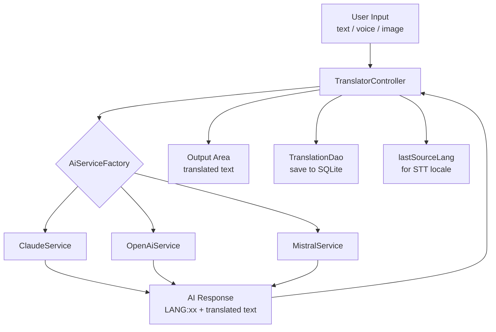
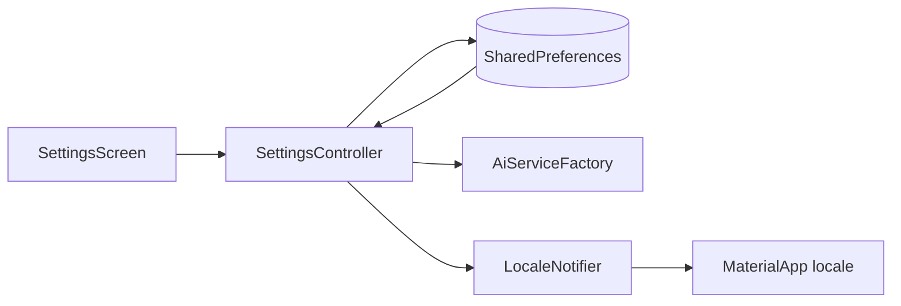

# Tafsiri — Architecture

> Living document. Update when architecture changes.

---

## System Overview

Tafsiri is a Flutter Android app that translates text using one of three AI backends (Mistral, Claude, OpenAI). Language detection is performed by the AI in the same prompt as translation (no local library, no second API call — see ADR-003). All translations are persisted locally in SQLite.

---

## Module Responsibilities

| Module | Location | Responsibility |
|--------|----------|----------------|
| `app.dart` | `lib/` | `MaterialApp`, theme, router, locale wiring |
| `AiService` (abstract) | `lib/core/services/` | Contract for all AI backends |
| `ClaudeService` | `lib/core/services/` | Anthropic Messages API calls |
| `OpenAiService` | `lib/core/services/` | OpenAI Chat Completions API calls |
| `MistralService` | `lib/core/services/` | Mistral Chat API calls |
| `DbHelper` | `lib/core/database/` | SQLite init, schema, migrations |
| `TranslationDao` | `lib/core/database/` | CRUD operations on `translation_entry` |
| `TranslatorController` | `lib/features/translator/` | Detect + translate flow, STT/OCR input, error/loading state |
| `HistoryController` | `lib/features/history/` | Load, delete, favourite history entries |
| `SettingsController` | `lib/features/settings/` | Read/write all SharedPreferences keys |
| `LocaleNotifier` | `lib/` (shared provider) | Live locale switching |
| `TranslationEntry` | `lib/shared/models/` | Data model, SQLite serialisation |

---

## Translation Data Flow



---

## Settings Data Flow



---

## Database Schema

```sql
CREATE TABLE translation_entry (
  id           INTEGER PRIMARY KEY AUTOINCREMENT,
  source_text  TEXT    NOT NULL,
  result_text  TEXT    NOT NULL,
  source_lang  TEXT    NOT NULL,   -- detected language (ISO 639-1 or full name)
  target_lang  TEXT    NOT NULL,   -- actually used target language
  ai_provider  TEXT    NOT NULL,   -- 'mistral' | 'claude' | 'openai'
  is_favourite INTEGER NOT NULL DEFAULT 0,
  created_at   TEXT    NOT NULL    -- ISO 8601 UTC
);
```

**Notes:**
- `created_at` stored as `DateTime.now().toUtc().toIso8601String()` for consistent sorting.
- `source_lang` may be a 2-letter ISO 639-1 code (`sw`, `de`) or a full language name depending on AI response — normalisation is a v2 candidate.
- Schema version: 1. Migration stubs in `db_helper.dart` `onUpgrade` — see ADR-014.

---

## External API Integration

| Provider | Endpoint | Model | Auth |
|----------|----------|-------|------|
| Anthropic (Claude) | `https://api.anthropic.com/v1/messages` | `claude-haiku-4-5` | `x-api-key` header |
| OpenAI | `https://api.openai.com/v1/chat/completions` | `gpt-4o-mini` | `Authorization: Bearer` header |
| Mistral | `https://api.mistral.ai/v1/chat/completions` | `mistral-small-latest` | `Authorization: Bearer` header |

All API keys are runtime-only via `SharedPreferences`. Never logged in plain text (masked as `sk-****`).

---

## Prompt Template

```
You are a translation assistant.
Detect the language of the following text.
If it is already [TARGET_LANG], translate it to [ALT_LANG].
Otherwise translate it to [TARGET_LANG].
Respond with EXACTLY this format and nothing else:
LANG:[ISO-639-1 code of the detected source language]
[translated text]

Text: [INPUT]
```

The `LANG:xx` prefix is stripped by `TranslatorController` before display. The extracted code is stored as `lastSourceLang` for STT locale mapping (see ADR-013).

---

## Localisation

10 supported locales, ARB files in `lib/l10n/`:

| Locale | File |
|--------|------|
| `en_GB` | `app_en_GB.arb` (canonical template) |
| `sw` | `app_sw.arb` |
| `de` | `app_de.arb` |
| `fr` | `app_fr.arb` |
| `nl` | `app_nl.arb` |
| `es` | `app_es.arb` |
| `da` | `app_da.arb` |
| `nb` | `app_nb.arb` (Norwegian Bokmål — see ADR-011) |
| `sv` | `app_sv.arb` |
| `pl` | `app_pl.arb` |

---

## Android Permissions

| Permission | Used by |
|------------|---------|
| `INTERNET` | All AI service HTTP calls |
| `RECORD_AUDIO` | `speech_to_text` (STT) |
| `CAMERA` | `image_picker` (camera source) |
| `READ_EXTERNAL_STORAGE` | `image_picker` (Android ≤ 12) |
| `READ_MEDIA_IMAGES` | `image_picker` (Android 13+) |

---

*Last updated: 2026-04-10 — v1.0.0 complete*
