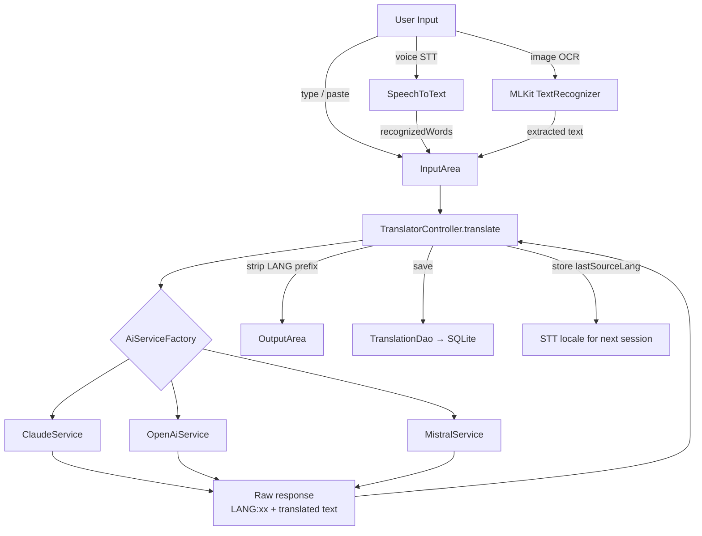
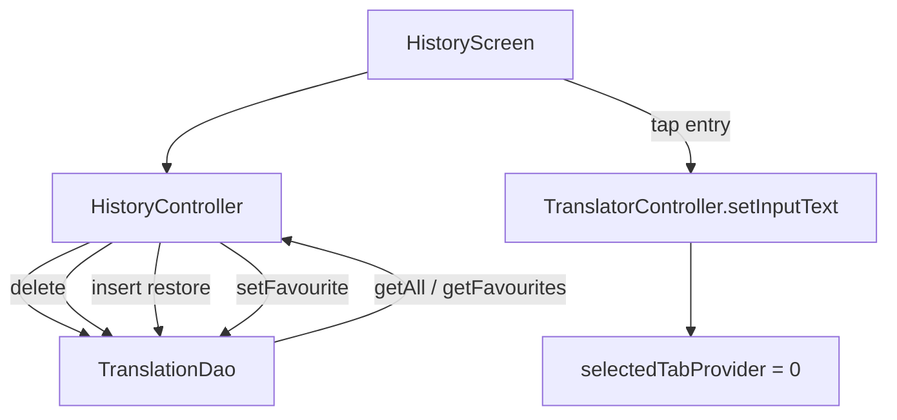

# Tafsiri — Architecture

> Living document. Update when architecture changes.

---

## System Overview

Tafsiri is a Flutter Android app that translates text using one of three AI backends (Mistral, Claude, OpenAI). Language detection is performed by the AI in the same prompt as translation (no local library, no second API call — see ADR-003). All translations are persisted locally in SQLite.

**Package:** `ke.darkman.tafsiri` · **Min SDK:** 21 · **Target SDK:** 34 · **Version:** 1.0.0+1

---

## Module Responsibilities

| Module | Location | Responsibility |
|--------|----------|----------------|
| `app.dart` | `lib/` | `MaterialApp`, light/dark theme, router, locale wiring |
| `main.dart` | `lib/` | `ProviderScope` entry point |
| `AiService` (abstract) | `lib/core/services/` | Contract for all AI backends |
| `ClaudeService` | `lib/core/services/` | Anthropic Messages API calls |
| `OpenAiService` | `lib/core/services/` | OpenAI Chat Completions API calls |
| `MistralService` | `lib/core/services/` | Mistral Chat API calls |
| `aiServiceProvider` | `lib/core/services/` | Riverpod `Provider` — selects backend from settings |
| `DbHelper` | `lib/core/database/` | SQLite init, schema version, migrations |
| `TranslationDao` | `lib/core/database/` | CRUD on `translation_entry` |
| `translationDaoProvider` | `lib/core/database/` | Riverpod `FutureProvider<TranslationDao>` |
| `TranslatorController` | `lib/features/translator/` | Translate flow, STT lifecycle, OCR pipeline, error/loading state |
| `HistoryController` | `lib/features/history/` | Load, delete, restore, toggleFavourite, favourites filter |
| `SettingsController` | `lib/features/settings/` | Read/write all SharedPreferences keys |
| `LocaleNotifier` | `lib/core/` | Live locale switching backed by SharedPreferences |
| `selectedTabProvider` | `lib/shared/providers/` | `StateProvider<int>` for programmatic tab navigation |
| `TranslationEntry` | `lib/shared/models/` | Data model, SQLite serialisation |

---

## Translation Data Flow



---

## Settings Data Flow


---

## History Data Flow



---

## Database Schema

```sql
CREATE TABLE translation_entry (
  id           INTEGER PRIMARY KEY AUTOINCREMENT,
  source_text  TEXT    NOT NULL,
  result_text  TEXT    NOT NULL,
  source_lang  TEXT    NOT NULL,   -- detected language (ISO 639-1 code)
  target_lang  TEXT    NOT NULL,   -- actually used target language
  ai_provider  TEXT    NOT NULL,   -- 'mistral' | 'claude' | 'openai'
  is_favourite INTEGER NOT NULL DEFAULT 0,
  created_at   TEXT    NOT NULL    -- ISO 8601 UTC
);
```

**Notes:**
- `created_at` stored as `DateTime.now().toUtc().toIso8601String()` for consistent sorting.
- `source_lang` is the 2-letter ISO 639-1 code extracted from the AI response `LANG:xx` prefix.
- Schema version: 1. Migration stubs in `db_helper.dart` `onUpgrade` — see ADR-014.

---

## External API Integration

| Provider | Endpoint | Model | Auth |
|----------|----------|-------|------|
| Anthropic (Claude) | `https://api.anthropic.com/v1/messages` | `claude-haiku-4-5-20251001` | `x-api-key` header |
| OpenAI | `https://api.openai.com/v1/chat/completions` | `gpt-4o-mini` | `Authorization: Bearer` |
| Mistral | `https://api.mistral.ai/v1/chat/completions` | `mistral-small-latest` | `Authorization: Bearer` |

All API keys are runtime-only via `SharedPreferences`. Never logged in plain text (masked as `sk-****` via `maskApiKey()`).

---

## Prompt Template

```
You are a translation assistant.
Detect the language of the following text.
If it is already [TARGET_LANG], translate it to [ALT_LANG].
Otherwise translate it to [TARGET_LANG].
Respond with EXACTLY this format and nothing else:
LANG:[ISO-639-1 code of the detected source language]
[translated text]

Text: [INPUT]
```

The `LANG:xx` prefix is stripped by `TranslatorController._extractTranslation()` before display. The code is stored as `lastSourceLang` for STT locale mapping (see ADR-013).

---

## Voice Input (STT)

`speech_to_text` v7. Lifecycle managed entirely in `TranslatorController`:

1. `_initStt()` called via `Future.microtask` on controller build. Sets `isSttAvailable`.
2. `toggleListening()` — starts or stops recognition.
3. Locale derived from `kSttLocaleMap[lastSourceLang]`; falls back to device locale if unknown.
4. Partial results stream live into the input field.
5. On `finalResult == true` → `translate()` triggered automatically.
6. `ref.onDispose` calls `_stt.stop()`.

STT locale map (ISO 639-1 → BCP-47):

| Language | Locale |
|----------|--------|
| Swahili | `sw-TZ` |
| German | `de-DE` |
| English | `en-GB` |
| French | `fr-FR` |
| Dutch | `nl-NL` |
| Spanish | `es-ES` |
| Danish | `da-DK` |
| Norwegian | `nb-NO` |
| Swedish | `sv-SE` |
| Polish | `pl-PL` |

---

## Image Input (OCR)

`image_picker` + `google_mlkit_text_recognition`. Flow:

1. User taps image button → bottom sheet with Camera / Gallery options.
2. `pickImageAndRecognize(source)` in `TranslatorController`.
3. `ImagePicker().pickImage(source)` → `XFile` path.
4. `TextRecognizer().processImage(InputImage.fromFilePath(...))` → `RecognizedText`.
5. Extracted text placed in input field. **No auto-translate** (ADR-015).
6. Empty result or exception → `ocrError` state flag → `ref.listen` in `TranslatorScreen` → floating SnackBar.
7. `isOcrProcessing` drives a spinner on the image button and disables it during processing.

---

## Localisation

11 ARB files in `lib/l10n/`, 39 user-facing strings each:

| Locale | File |
|--------|------|
| `en_GB` | `app_en_GB.arb` (canonical template with `@`-metadata) |
| `en` | `app_en.arb` (fallback) |
| `sw` | `app_sw.arb` |
| `de` | `app_de.arb` |
| `fr` | `app_fr.arb` |
| `nl` | `app_nl.arb` |
| `es` | `app_es.arb` |
| `da` | `app_da.arb` |
| `nb` | `app_nb.arb` (Norwegian Bokmål — see ADR-011) |
| `sv` | `app_sv.arb` |
| `pl` | `app_pl.arb` |

Generated via `flutter gen-l10n` (config in `l10n.yaml`). `AppLocalizations` injected into `MaterialApp`.

---

## Android Permissions

| Permission | Used by |
|------------|---------|
| `INTERNET` | All AI service HTTP calls |
| `RECORD_AUDIO` | `speech_to_text` (STT) |
| `CAMERA` | `image_picker` (camera source) |
| `READ_EXTERNAL_STORAGE` | `image_picker` (Android ≤ 12) |
| `READ_MEDIA_IMAGES` | `image_picker` (Android 13+) |

---

## Launcher Icon

SVG source: `assets/icon/icon.svg` — two speech bubbles (solid + outline) with translation arrow, teal `#00897B` background, rounded-square shape (see ADR-018).

Generated densities via `flutter_launcher_icons`:

| Density | Size | Location |
|---------|------|----------|
| mdpi | 48 × 48 | `mipmap-mdpi/` |
| hdpi | 72 × 72 | `mipmap-hdpi/` |
| xhdpi | 96 × 96 | `mipmap-xhdpi/` |
| xxhdpi | 144 × 144 | `mipmap-xxhdpi/` |
| xxxhdpi | 192 × 192 | `mipmap-xxxhdpi/` |
| Adaptive | vector XML | `mipmap-anydpi-v26/` |

---

## Theme

Material 3, teal seed colour. Both `theme` (light) and `darkTheme` (dark) provided; `ThemeMode.system` follows device preference (see ADR-019).

Customisations:
- `AppBarTheme`: elevation 0, `scrolledUnderElevation: 1`
- `CardThemeData`: elevation 1
- `InputDecorationTheme`: outlined + filled, border radius 12
- `SnackBarThemeData`: floating, border radius 8

---

## Release Build

```bash
# Debug APK (uses debug keystore automatically)
flutter build apk --debug
# → build/app/outputs/flutter-apk/app-debug.apk

# Release APK (requires production keystore — see ADR-016)
flutter build apk --release
# → build/app/outputs/flutter-apk/app-release.apk
```

Production keystore is **not** committed to git. Reference via `android/key.properties` (gitignored). See ADR-016.

---

## Test Coverage

| Test suite | File | Tests |
|------------|------|-------|
| SettingsController | `test/settings_controller_test.dart` | 8 |
| TranslatorController | `test/translator/translator_controller_test.dart` | 10 |
| TranslatorScreen widgets | `test/translator/translator_screen_test.dart` | 6 |
| ClaudeService | `test/services/claude_service_test.dart` | 4 |
| OpenAiService | `test/services/openai_service_test.dart` | 4 |
| MistralService | `test/services/mistral_service_test.dart` | 4 |
| TranslationDao (SQLite) | `test/database/translation_dao_test.dart` | 8 |
| **Total** | | **44** |

Run: `flutter test`

---

*Last updated: 2026-04-10 — v1.0.0 complete (all 12 phases)*
