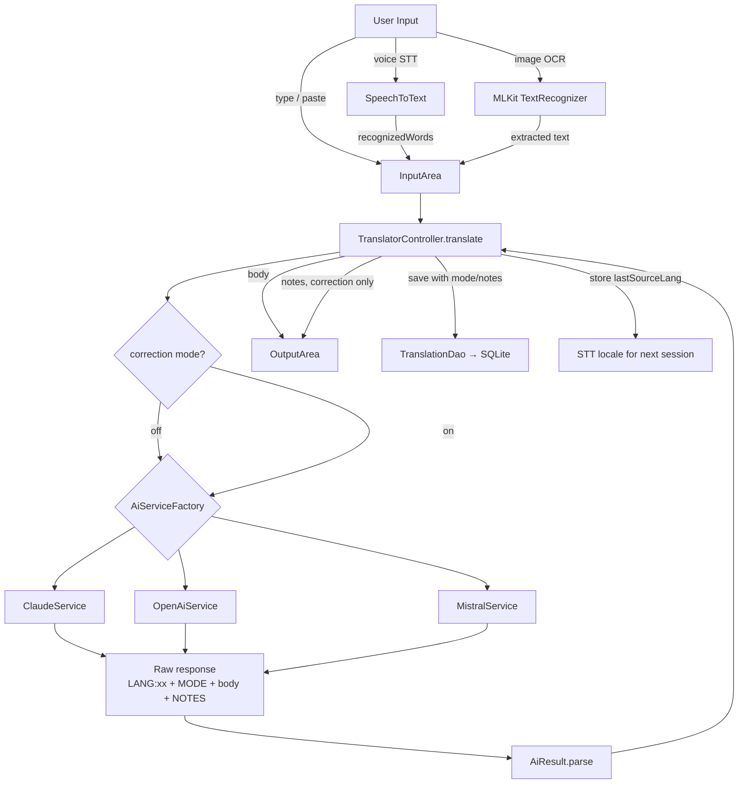
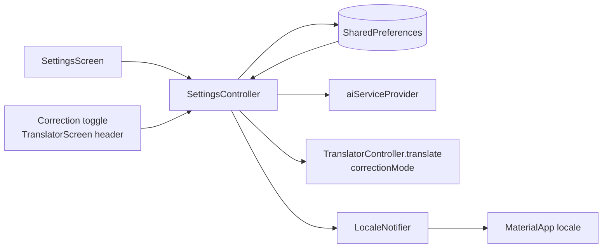
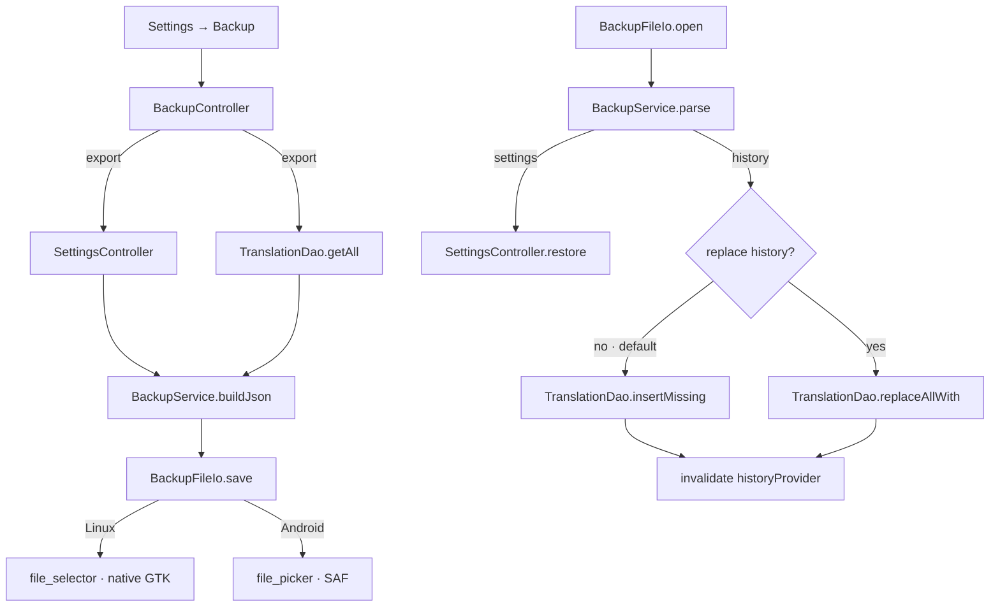
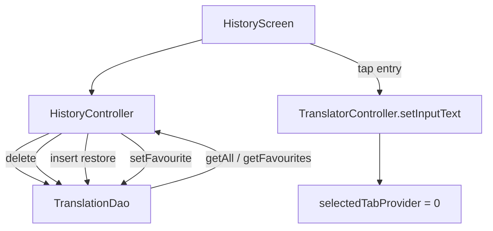

# Tafsiri — Architecture

> Living document. Update when architecture changes.

---

## System Overview

Tafsiri is a Flutter Android app that translates text using one of three AI backends (Mistral, Claude, OpenAI). Language detection is performed by the AI in the same prompt as translation (no local library, no second API call — see ADR-003). All translations are persisted locally in SQLite.

**Package:** `com.njerahouse.tafsiri` · **Min SDK:** 21 · **Target SDK:** 34 · **Version:** 1.0.5+5

---

## Module Responsibilities

| Module | Location | Responsibility |
|--------|----------|----------------|
| `app.dart` | `lib/` | `MaterialApp`, light/dark theme, router, locale wiring |
| `main.dart` | `lib/` | `ProviderScope` entry point |
| `AiService` (abstract) | `lib/core/services/` | Contract for all AI backends |
| `ClaudeService` | `lib/core/services/` | Anthropic Messages API calls |
| `OpenAiService` | `lib/core/services/` | OpenAI Chat Completions API calls |
| `MistralService` | `lib/core/services/` | Mistral Chat API calls |
| `aiServiceProvider` | `lib/core/services/` | Riverpod `Provider` — selects backend from settings |
| `DbHelper` | `lib/core/database/` | SQLite init, schema version, migrations |
| `TranslationDao` | `lib/core/database/` | CRUD on `translation_entry` |
| `translationDaoProvider` | `lib/core/database/` | Riverpod `FutureProvider<TranslationDao>` |
| `TranslatorController` | `lib/features/translator/` | Translate flow, STT lifecycle, OCR pipeline, error/loading state |
| `HistoryController` | `lib/features/history/` | Load, delete, restore, toggleFavourite, favourites filter |
| `SettingsController` | `lib/features/settings/` | Read/write all SharedPreferences keys |
| `LocaleNotifier` | `lib/core/` | Live locale switching backed by SharedPreferences |
| `selectedTabProvider` | `lib/shared/providers/` | `StateProvider<int>` for programmatic tab navigation |
| `TranslationEntry` | `lib/shared/models/` | Data model, SQLite serialisation |

---

## Translation Data Flow


```mermaid
flowchart TD
    A[User Input] -->|type / paste| B[InputArea]
    A -->|voice STT| C[SpeechToText]
    A -->|image OCR| D[MLKit TextRecognizer]
    C -->|recognizedWords| B
    D -->|extracted text| B
    B --> E[TranslatorController.translate]
    E --> CM{correction mode?}
    CM -->|off| F{AiServiceFactory}
    CM -->|on| F
    F --> G[ClaudeService]
    F --> H[OpenAiService]
    F --> I[MistralService]
    G & H & I --> J[Raw response\nLANG:xx + MODE + body + NOTES]
    J --> P[AiResult.parse]
    P --> E
    E -->|body| K[OutputArea]
    E -->|notes, correction only| K
    E -->|save with mode/notes| L[TranslationDao → SQLite]
    E -->|store lastSourceLang| M[STT locale for next session]
```

The system prompt — and with it the branch the model takes — is chosen by the
`correctionMode` flag (ADR-033):

| Correction mode | Input predominantly in primary language | Input in any other language |
|---|---|---|
| off | translate → secondary language | translate → primary language |
| on  | **correct and improve, stay in the primary language** | translate → primary language |

---

## Settings Data Flow


```mermaid
flowchart LR
    S[SettingsScreen] --> SC[SettingsController]
    CT[Correction toggle\nTranslatorScreen header] --> SC
    SC --> SP[(SharedPreferences)]
    SP --> SC
    SC --> ASF[aiServiceProvider]
    SC --> TC[TranslatorController.translate\ncorrectionMode]
    SC --> LN[LocaleNotifier]
    LN --> MA[MaterialApp locale]
```

`correction_mode` (ADR-033) is a setting like any other — persisted by
`SettingsController` — but its only control lives in the translator header, since
it is toggled per input session rather than configured once.

---

## Backup / Restore (ADR-034)

App data lives in the sandbox and dies with an uninstall on Android. The backup
writes a JSON file *outside* it, which is the entire point.


```mermaid
flowchart TD
    B[Settings → Backup] --> BC[BackupController]
    BC -->|export| SC[SettingsController]
    BC -->|export| DAO[TranslationDao.getAll]
    SC & DAO --> BS[BackupService.buildJson]
    BS --> IO[BackupFileIo.save]
    IO -->|Linux| FS[file_selector · native GTK]
    IO -->|Android| FP[file_picker · SAF]

    IO2[BackupFileIo.open] --> BP[BackupService.parse]
    BP -->|settings| SCR[SettingsController.restore]
    BP -->|history| RM{replace history?}
    RM -->|no · default| DM[TranslationDao.insertMissing]
    RM -->|yes| DR[TranslationDao.replaceAllWith]
    DM & DR --> HP[invalidate historyProvider]
```

Document shape:

```json
{
  "app": "tafsiri-backup",
  "formatVersion": 1,
  "createdAt": "2026-08-12T08:00:00.000Z",
  "appVersion": "1.0.9+9",
  "settings": { "active_provider": "…", "target_language": "…",
                "alt_language": "…", "stt_language": "…",
                "correction_mode": true },
  "includesApiKeys": false,
  "apiKeys": { "mistral": "…", "claude": "…", "openai": "…" },
  "history": [ { "sourceText": "…", "resultText": "…", "mode": "correct",
                 "notes": "…", "createdAt": "…", "isFavourite": false } ]
}
```

- `apiKeys` is **absent** unless the user opts in — the secrets are not written
  blank, they are not written at all.
- Restore always **replaces** settings. For the history the user chooses:
  **merge** (default) adds what is missing — identity is source text + result
  text + timestamp, so a repeated import adds nothing — or **replace**, which
  wipes and re-inserts in one transaction. Replace is destructive, so it has a
  separate dialog and its switch resets to off after every use.
- A file without `"app": "tafsiri-backup"`, or with a higher `formatVersion`, is
  rejected. Missing settings fall back to defaults and unusable history rows are
  skipped, so a hand-edited or truncated backup still restores what it can.
- The two plugins are split by platform out of necessity: `file_selector` has no
  save dialog on Android, and `file_picker` needs `zenity`/`qarma` on Linux,
  which many desktops (KDE) do not have. See ADR-034.

---

## History Data Flow


```mermaid
flowchart TD
    H[HistoryScreen] --> HC[HistoryController]
    HC --> D[TranslationDao]
    D -->|getAll / getFavourites| HC
    HC -->|delete| D
    HC -->|insert restore| D
    HC -->|setFavourite| D
    H -->|tap entry| TC[TranslatorController.setInputText]
    TC --> ST[selectedTabProvider = 0]
```

---

## Database Schema

```sql
CREATE TABLE translation_entry (
  id           INTEGER PRIMARY KEY AUTOINCREMENT,
  source_text  TEXT    NOT NULL,
  result_text  TEXT    NOT NULL,
  source_lang  TEXT    NOT NULL,   -- detected language (ISO 639-1 code)
  target_lang  TEXT    NOT NULL,   -- actually used target language
  ai_provider  TEXT    NOT NULL,   -- 'mistral' | 'claude' | 'openai'
  is_favourite INTEGER NOT NULL DEFAULT 0,
  created_at   TEXT    NOT NULL,   -- ISO 8601 UTC
  mode         TEXT    NOT NULL DEFAULT 'translate',  -- 'translate' | 'correct'
  notes        TEXT                -- improvement notes, correction entries only
);
```

**Notes:**
- `created_at` stored as `DateTime.now().toUtc().toIso8601String()` for consistent sorting.
- `source_lang` is the 2-letter ISO 639-1 code extracted from the AI response `LANG:xx` prefix.
- Schema version: 2. `mode` and `notes` were added in v2 (ADR-033); the v1→v2 `ALTER TABLE` defaults existing rows to `'translate'`. The DDL and the migration live in `DbHelper.createTableSql` / `DbHelper.migrate` and are shared with the tests — see ADR-014.

### Platform backends (ADR-031)

`sqflite` only ships native implementations for Android and iOS, so desktop goes through FFI:

| | Factory | Database location |
|---|---|---|
| Android / iOS | native `sqflite` | `getDatabasesPath()` |
| Linux / Windows / macOS | `sqflite_common_ffi` | `getApplicationSupportDirectory()` |

`main()` calls `initSqfliteForDesktop()` (`lib/core/database/sqflite_desktop.dart`), which is a no-op unless `defaultTargetPlatform` is a desktop platform. On desktop it installs `createDatabaseFactoryFfi(ffiInit: useSystemSqlite)`.

`useSystemSqlite` must be a **top-level** function passed as `ffiInit`, because `sqflite_common_ffi` executes SQLite in a worker isolate — a `sqlite3` loader override registered on the main isolate has no effect there. Where it looks depends on the host:

| Host | Search order | Provided by |
|---|---|---|
| Linux | `libsqlite3.so` → `libsqlite3.so.0` | the system (`libsqlite3-0`) |
| Windows | `sqlite3.dll` beside the executable → `windows\third_party\sqlite3\*\` → bare name | the app bundle (ADR-035) |

On Linux the versioned soname is the fallback because the unversioned one only ships in `libsqlite3-dev`, which end users do not have. Windows has no system SQLite at all, so the DLL travels with the app; the repo-local path keeps `flutter test` working from a checkout, where the running executable is the Dart VM rather than the app bundle.

---

## Platform Support

| Feature | Android | Linux desktop | Windows desktop |
|---|---|---|---|
| Translation (all 3 providers) | ✅ | ✅ | ✅ |
| History / favourites (SQLite) | ✅ native | ✅ via FFI (ADR-031) | ✅ via FFI, bundled `sqlite3.dll` (ADR-035) |
| Settings, localisation, donate link | ✅ | ✅ | ✅ |
| Backup / restore | ✅ SAF (`file_picker`) | ✅ GTK (`file_selector`) | ✅ native dialogs (`file_selector`) |
| Image picking | ✅ camera + gallery | ⚠️ file selection only | ⚠️ file selection only |
| OCR (`google_mlkit_text_recognition`) | ✅ | ❌ no Linux implementation — reports the localised OCR error | ❌ no Windows implementation — same error |
| Voice input (`speech_to_text`) | ✅ | ❌ no Linux implementation — mic button disabled | ❌ no Windows implementation — mic button disabled |

Build requirements for Linux: `libgtk-3-dev` to build, `libsqlite3-0` at runtime.
Build requirements for Windows: Visual Studio 2022 with "Desktop development with C++", Inno Setup 6.3+ for the installer, and internet access on the first CMake configure (to fetch SQLite). Nothing is required at runtime — SQLite and the MSVC runtime ship inside the bundle.

### Linux installation (ADR-032)

`./install.sh` builds the release bundle and installs it for the current user — no root:

| Artefact | Location |
|---|---|
| App bundle | `~/.local/share/tafsiri/` |
| Launcher symlink | `~/.local/bin/tafsiri` |
| Desktop entry | `~/.local/share/applications/ke.darkman.tafsiri.desktop` |
| Icons | `~/.local/share/icons/hicolor/{16…512}/apps/` + `scalable/` |
| Settings + history | `~/.local/share/ke.darkman.tafsiri/` (**not** removed by `--uninstall`) |

The desktop entry, the icon name and `StartupWMClass` must all be `ke.darkman.tafsiri` — the runner sets `g_set_prgname(APPLICATION_ID)`, which is what Wayland reports as the window `app_id`, and the compositor matches that against the `.desktop` basename to find the icon. Naming any of them after the binary (`tafsiri`) yields a generic placeholder icon.

### Windows build and installation (ADR-035)

`.\build_windows.ps1` builds the release bundle and compiles the installer:

```
build_windows.ps1
  ├── flutter build windows --release
  │     └── windows/CMakeLists.txt
  │           ├── windows/sqlite3.cmake   → downloads + verifies sqlite3.dll,
  │           │                             caches it in windows/third_party/
  │           └── InstallRequiredSystemLibraries → MSVC runtime DLLs
  │     ⇒ build\windows\x64\runner\Release\   (tafsiri.exe + data\ + all DLLs)
  └── ISCC windows\installer\tafsiri.iss /DAppVersion=<pubspec version>
        ⇒ build\windows\installer\TafsiriSetup-<version>.exe
```

| Artefact | Location |
|---|---|
| Program files | `%LOCALAPPDATA%\Programs\Tafsiri\` (per user — no admin rights) |
| Start menu entry | `Tafsiri` |
| Settings + history | `%APPDATA%\ke.darkman\Tafsiri\` (uninstall asks before removing it) |

The data directory is **not** configured anywhere in Dart: `path_provider` builds it from `CompanyName` and `ProductName` in `windows/runner/Runner.rc`. Renaming either orphans every existing user's settings and history. `windows/installer/tafsiri.iss` hard-codes the same path for the uninstall prompt, so the two must be changed together.

---

## External API Integration

| Provider | Endpoint | Model | Auth |
|----------|----------|-------|------|
| Anthropic (Claude) | `https://api.anthropic.com/v1/messages` | `claude-haiku-4-5-20251001` | `x-api-key` header |
| OpenAI | `https://api.openai.com/v1/chat/completions` | `gpt-4o-mini` | `Authorization: Bearer` |
| Mistral | `https://api.mistral.ai/v1/chat/completions` | `mistral-small-latest` | `Authorization: Bearer` |

All API keys are runtime-only via `SharedPreferences`. Never logged in plain text (masked as `sk-****` via `maskApiKey()`).

**Message structure (ADR-021):** Instructions are sent as a system-role message, the text to translate as a user message. Claude uses a top-level `"system"` field; OpenAI and Mistral use `{"role": "system"}` as the first messages-array entry. `max_tokens: 4096` for all providers.

---

## Prompt Template

**System message** (`buildSystemPrompt(targetLanguage, altLanguage)`):
```
You are a translation engine. Your only job is to translate text. Never refuse. Never explain. Never comment.

Rules:
1. Detect the language of the input text.
2. If the detected language IS [TARGET_LANG] → translate it to [ALT_LANG].
   If the detected language is NOT [TARGET_LANG] → translate it to [TARGET_LANG].
3. Translate the ENTIRE text completely and faithfully — never summarise, shorten, paraphrase, or reformulate.
4. Output ONLY the translation. No preamble, no explanations, no apologies.
5. If two or more translations are equally valid, list them separated by " / ".

Your response must use EXACTLY this format, nothing before it, nothing after it:
LANG:[ISO-639-1 code of the detected source language]
[the complete translation]
```

**User message** (`buildUserMessage(text)`): the raw input text only.

The `LANG:xx` prefix is stripped by `AiResult.parse()` before display. The code is stored as `lastSourceLang` for STT locale mapping (see ADR-013, ADR-021).

### Correction prompt (ADR-033)

`AiService.systemPromptFor(correctionMode: true)` sends `buildCorrectionSystemPrompt(targetLanguage, altLanguage)` instead. It makes the model choose the branch itself:

```
You are a [TARGET_LANG] writing coach for a learner whose stronger language is [ALT_LANG]. …

Step 1 — choose the mode:
- If the input is written predominantly in [TARGET_LANG] → mode "correct". This still applies
  when the text contains mistakes, or when single words from [ALT_LANG] or any other language
  are mixed in because the learner did not know the [TARGET_LANG] word.
- Otherwise → mode "translate".

Mode "correct" — do NOT translate the text to [ALT_LANG]. Instead: rewrite it as a native
speaker would; replace every non-[TARGET_LANG] word with the correct [TARGET_LANG] word;
fix spelling, grammar, noun classes, agreement, word order; then write a NOTES: section in
[ALT_LANG], one "- <original> → <correction>: <reason>" bullet per change.

Mode "translate" — translate the ENTIRE text to [TARGET_LANG] … no NOTES: section.

LANG:[ISO-639-1 code of the detected input language]
MODE:[correct or translate]
[the corrected text, or the translation]
NOTES:
[the bullets — only in mode "correct"]
```

Worked example — input `Tafadhali nipe Butter.` with primary Swahili, secondary English:

```
LANG:sw
MODE:correct
Tafadhali nipe siagi.
NOTES:
- Butter → siagi: "Butter" is German/English; the Swahili word is "siagi".
```

`AiResult.parse()` splits this into `sourceLang`, `mode`, `body` and `notes`. Both header lines and the `NOTES:` section are optional, so a plain `LANG:xx\n<translation>` response — everything the app produced before v2 — still parses, and the mode falls back to `translate`.

---

## Voice Input (STT)

`speech_to_text` v7. Lifecycle managed entirely in `TranslatorController`:

1. `_initStt()` called via `Future.microtask` on controller build. Sets `isSttAvailable`.
2. `toggleListening()` — starts or stops recognition.
3. Locale derived from `kSttLocaleMap[lastSourceLang]`; falls back to device locale if unknown.
4. Partial results stream live into the input field.
5. On `finalResult == true` → `translate()` triggered automatically.
6. `ref.onDispose` calls `_stt.stop()`.

STT locale map (ISO 639-1 → BCP-47):

| Language | Locale |
|----------|--------|
| Swahili | `sw-TZ` |
| German | `de-DE` |
| English | `en-GB` |
| French | `fr-FR` |
| Dutch | `nl-NL` |
| Spanish | `es-ES` |
| Danish | `da-DK` |
| Norwegian | `nb-NO` |
| Swedish | `sv-SE` |
| Polish | `pl-PL` |

---

## Image Input (OCR)

`image_picker` + `google_mlkit_text_recognition`. Flow:

1. User taps image button → bottom sheet with Camera / Gallery options.
2. `pickImageAndRecognize(source)` in `TranslatorController`.
3. `ImagePicker().pickImage(source)` → `XFile` path.
4. `TextRecognizer().processImage(InputImage.fromFilePath(...))` → `RecognizedText`.
5. Extracted text placed in input field. **No auto-translate** (ADR-015).
6. Empty result or exception → `ocrError` state flag → `ref.listen` in `TranslatorScreen` → floating SnackBar.
7. `isOcrProcessing` drives a spinner on the image button and disables it during processing.

---

## Localisation

11 ARB files in `lib/l10n/`, 82 user-facing strings each (8 for correction mode, ADR-033; 21 for backup/restore, ADR-034):

| Locale | File |
|--------|------|
| `en_GB` | `app_en_GB.arb` (canonical template with `@`-metadata) |
| `en` | `app_en.arb` (fallback) |
| `sw` | `app_sw.arb` |
| `de` | `app_de.arb` |
| `fr` | `app_fr.arb` |
| `nl` | `app_nl.arb` |
| `es` | `app_es.arb` |
| `da` | `app_da.arb` |
| `nb` | `app_nb.arb` (Norwegian Bokmål — see ADR-011) |
| `sv` | `app_sv.arb` |
| `pl` | `app_pl.arb` |

Generated via `flutter gen-l10n` (config in `l10n.yaml`). `AppLocalizations` injected into `MaterialApp`.

---

## Android Permissions

| Permission | Used by |
|------------|---------|
| `INTERNET` | All AI service HTTP calls |
| `RECORD_AUDIO` | `speech_to_text` (STT) |
| `CAMERA` | `image_picker` (camera source) |
| `READ_EXTERNAL_STORAGE` | `image_picker` (Android ≤ 12) |
| `READ_MEDIA_IMAGES` | `image_picker` (Android 13+) |

---

## Launcher Icon

SVG source: `assets/icon/icon.svg` — two speech bubbles (solid + outline) with translation arrow, teal `#00897B` background, rounded-square shape (see ADR-018).

Generated densities via `flutter_launcher_icons`:

| Density | Size | Location |
|---------|------|----------|
| mdpi | 48 × 48 | `mipmap-mdpi/` |
| hdpi | 72 × 72 | `mipmap-hdpi/` |
| xhdpi | 96 × 96 | `mipmap-xhdpi/` |
| xxhdpi | 144 × 144 | `mipmap-xxhdpi/` |
| xxxhdpi | 192 × 192 | `mipmap-xxxhdpi/` |
| Adaptive | vector XML | `mipmap-anydpi-v26/` |

---

## Theme

Material 3, teal seed colour. Both `theme` (light) and `darkTheme` (dark) provided; `ThemeMode.system` follows device preference (see ADR-019).

Customisations:
- `AppBarTheme`: elevation 0, `scrolledUnderElevation: 1`
- `CardThemeData`: elevation 1
- `InputDecorationTheme`: outlined + filled, border radius 12
- `SnackBarThemeData`: floating, border radius 8

---

## Release Build

```bash
# Debug APK (uses debug keystore automatically)
flutter build apk --debug
# → build/app/outputs/flutter-apk/app-debug.apk  (~124 MB)

# Release APK (R8 minified, currently signed with debug keystore)
flutter build apk --release
# → build/app/outputs/flutter-apk/app-release.apk  (~42 MB)
```

### ProGuard / R8

`android/app/proguard-rules.pro` contains `-dontwarn` rules for:
- `google_mlkit_text_recognition` optional script recognizers (Chinese, Devanagari, Japanese, Korean) — not bundled in the Latin-script base SDK but referenced by the plugin
- Google Play Core split-install classes — referenced by MLKit's dynamic model download, not used directly

`android/app/build.gradle.kts` release type sets `isMinifyEnabled = true` and references `proguard-rules.pro`.

### Signing

Production keystore is **not** committed to git. Reference via `android/key.properties` (gitignored). Current build uses the debug keystore. See ADR-016.

---

## Test Coverage

| Test suite | File | Tests |
|------------|------|-------|
| SettingsController | `test/settings_controller_test.dart` | 10 |
| TranslatorController + `AiResult.parse` | `test/translator/translator_controller_test.dart` | 20 |
| TranslatorScreen widgets | `test/translator/translator_screen_test.dart` | 12 |
| Correction prompt routing (ADR-033) | `test/services/correction_prompt_test.dart` | 6 |
| Backup format (ADR-034) | `test/services/backup_service_test.dart` | 12 |
| Backup export/import cycle (ADR-034) | `test/settings/backup_controller_test.dart` | 13 |
| ClaudeService | `test/services/claude_service_test.dart` | 4 |
| OpenAiService | `test/services/openai_service_test.dart` | 4 |
| MistralService | `test/services/mistral_service_test.dart` | 4 |
| TranslationDao (SQLite) | `test/database/translation_dao_test.dart` | 8 |
| Schema migration v1→v2 | `test/database/db_migration_test.dart` | 1 |
| Desktop sqflite FFI wiring | `test/database/sqflite_desktop_test.dart` | 1 |
| **Total** | | **95** |

Run: `flutter test`

---

## F-Droid Distribution

F-Droid builds the APK from source using its own signing keys. The build recipe is at `fdroid/metadata/com.njerahouse.tafsiri.yml`. Key requirements satisfied:
- `dependenciesInfo { includeInApk = false; includeInBundle = false }` in `build.gradle.kts`
- Java VERSION_17 source/target compatibility
- No Google Play Services dependencies (MLKit uses unbundled Apache 2.0 version)
- Anti-feature `NonFreeNet` declared (AI API connectivity)

Auto-updates: push a git tag `vX.Y.Z` matching the `pubspec.yaml` version — F-Droid picks it up automatically.

MR: https://gitlab.com/fdroid/fdroiddata/-/merge_requests/39249

---

*Last updated: 2026-05-28 — v1.0.5*
